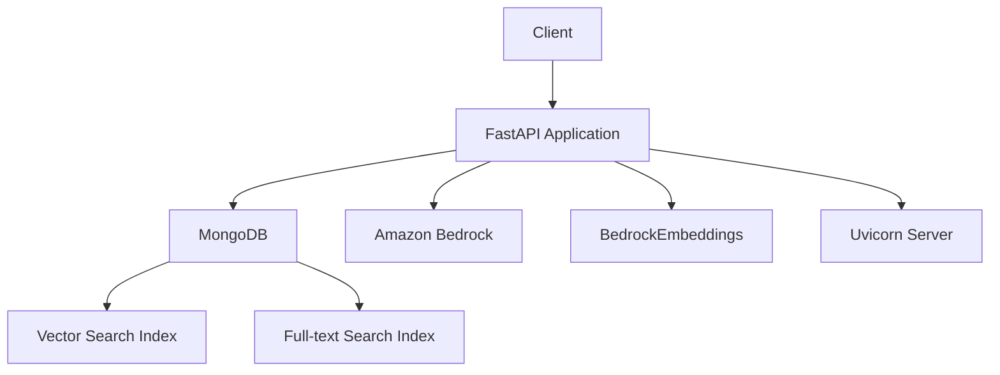

# AI Knowledge and Memory Service Documentation

## Table of Contents
1. [Overview](#1-overview)
2. [System Architecture](#2-system-architecture)
3. [Components](#3-components)
4. [Installation & Deployment](#4-installation--deployment)
5. [Configuration](#5-configuration)
6. [Usage](#6-usage)
7. [API Reference](#7-api-reference)
8. [Security Considerations](#8-security-considerations)
9. [Monitoring & Logging](#9-monitoring--logging)
10. [Troubleshooting](#10-troubleshooting)
11. [Development Guide](#11-development-guide)
12. [Maintenance & Operations](#12-maintenance--operations)

### 1. Overview

The AI Knowledge and Memory Service is a FastAPI-based application designed to provide a robust system for managing, storing, and retrieving AI-generated conversations and knowledge. It offers capabilities for adding messages to conversations, searching through stored memories, and generating summaries of conversations. The service integrates with MongoDB for data storage and Amazon Bedrock for AI-powered text embeddings and conversation summarization.

Key features include:
- Conversation storage and retrieval
- Hybrid search combining full-text and vector-based semantic search
- Context-aware memory retrieval
- AI-powered conversation summarization

This service is ideal for applications requiring sophisticated conversation management, such as chatbots, virtual assistants, or knowledge management systems.

### 2. System Architecture

The AI Knowledge and Memory Service follows a modular architecture, integrating various components to provide a comprehensive solution for AI-powered conversation management.



The system consists of the following main components:
- FastAPI application serving as the core of the service
- MongoDB for data storage and indexing
- Amazon Bedrock for AI model interactions
- BedrockEmbeddings for generating text embeddings
- Uvicorn server for running the FastAPI application

### 3. Components

#### FastAPI Application
- **Purpose**: Serves as the main entry point and handles HTTP requests
- **Core Functionality**: Routing, request handling, and response generation
- **Technologies**: Python, FastAPI

#### MongoDB
- **Purpose**: Persistent storage for conversations and vector embeddings
- **Core Functionality**: Document storage, indexing, and querying
- **Technologies**: MongoDB, PyMongo

#### Amazon Bedrock
- **Purpose**: Provides AI capabilities for text embeddings and summarization
- **Core Functionality**: Text embedding generation, conversation summarization
- **Technologies**: boto3, BedrockEmbeddings

#### Search Functionality
- **Purpose**: Enables efficient retrieval of relevant conversation data
- **Core Functionality**: Hybrid search combining full-text and vector search
- **Technologies**: MongoDB Atlas Search, custom aggregation pipelines

### 4. Installation & Deployment

Prerequisites:
- Python 3.10+
- MongoDB Atlas account
- AWS account with Bedrock access

Steps:
1. Clone the repository:
   ```
   git clone <repository_url>
   cd ai-memory
   ```

2. Install dependencies:
   ```
   pip install -r requirements.txt
   ```

3. Set up environment variables (see Configuration section)

4. Run the application:
   ```
   python main.py
   ```

### 5. Configuration

Create a `.env` file in the project root with the following variables:

```
MONGODB_URI=<your_mongodb_connection_string>
LLM_MODEL_ID=<your_bedrock_model_id>
AWS_ACCESS_KEY_ID=<your_aws_access_key>
AWS_SECRET_ACCESS_KEY=<your_aws_secret_key>
AWS_REGION=<your_aws_region>
```

### 6. Usage

The service exposes several HTTP endpoints for interacting with the AI memory system. Here are some common operations:

1. Add a message to a conversation:
   ```
   POST /conversation/{user_id}/{conversation_id}
   Body: {"type": "human", "text": "Hello, AI!"}
   ```

2. Search memory:
   ```
   GET /search/?user_id=123&query=AI+capabilities
   ```

3. Retrieve conversation context:
   ```
   GET /get_conversation_context/?_id=<message_id>
   ```

4. Generate conversation summary:
   ```
   GET /generate_conversation_summary/
   Body: <JSON-encoded conversation data>
   ```

### 7. API Reference

#### POST /conversation/{user_id}/{conversation_id}
Adds a message to a conversation.

#### GET /search/
Searches memory items using hybrid search.

#### GET /conversation/
Retrieves conversation messages by conversation ID and user ID.

#### GET /generate_conversation_summary/
Generates a summary for a conversation using the Bedrock model.

#### GET /get_conversation_context/
Retrieves a conversation with additional context around matching messages.

#### GET /retrieve_memory/
Retrieves memory items, context, and summary for a specified user based on input text.
This is the one you should use to get the related conversation and it's summary for the user's message.

### 8. Security Considerations

- Use HTTPS for all API communications
- Implement proper authentication and authorization mechanisms
- Regularly update dependencies and apply security patches
- Ensure secure handling of AWS and MongoDB credentials

### 9. Monitoring & Logging

- Utilize FastAPI's built-in logging capabilities
- Monitor MongoDB performance and index usage
- Set up AWS CloudWatch for Bedrock service monitoring
- Implement application-level logging for critical operations and errors

### 10. Troubleshooting

Common issues and solutions:
- Connection errors: Check MongoDB URI and network connectivity
- Bedrock API errors: Verify AWS credentials and permissions
- Slow queries: Analyze MongoDB index usage and query performance

### 11. Development Guide

- Follow PEP 8 style guide for Python code
- Use type hints and docstrings for better code readability
- Implement unit tests for critical functions

### 12. Maintenance & Operations

- Regularly backup MongoDB data
- Monitor and optimize MongoDB indexes
- Keep dependencies updated
- Implement a CI/CD pipeline for automated testing and deployment

This documentation provides a comprehensive overview of the AI Knowledge and Memory Service. For more detailed information on specific components or functionalities, refer to the inline comments and docstrings within the source code.